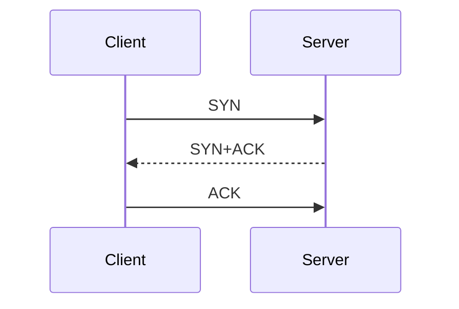

# What happens when you type a URL in a browser?

Let's say you typed `google.com` in your browser.

## 1. Browser parsing

The browser interprets it as a website address and thus it becomes `https://www.google.com/`.
Then, the browser asks "What server should I connect to?"

## 2. IP address

To connect to the server, the browser must know the IP address, but `google.com` is just a domain name. We do not yet have the IP address. So the browser looks it up on DNS (Domain name system). This may involve several layer of caching. Using DNS, the browser can translate the domain name to the IP address.

## 3. Network connection

Now the browser has the address, it needs to establish a network connection to the server.

## 4. TCP

The browser tries to establish a TCP connection with the server.
The request travels through:
Computer -> Wi-Fi router -> ISP -> Internet -> Google's network -> 140.250.x.x:443

This involves the famous three-way handshake.

In this diagram, the client initiates the TCP connection by sending a SYN packet to the server.
The server responds with a SYN+ACK packet, indicating its willingness to establish a connection.
Finally, the client sends an ACK packet to acknowledge the server's response, completing the three-way handshake process and establishing a TCP connection between the client and the server.

TCP connection ensures reliable, ordered-byte stream between two endpoints.

## 5. TLS

Since we are using `https`, we need encryption. TLS ensure secure connection. Once TLS is established, the HTTP traffic is encrypted.

## 6. HTTP request

The browser sends an HTTP request, asking Google server for the page.

## 7. Google server

Google's infrastructure receives the request and it processes the request through several steps including authentication, authorisation, business logic, and DB. Eventually, it generates an HTTP response with HTML.

## 8. Response

The response travels back. TCP ensures that data arrives reliably and in order. TLS ensures that the data is encrypted while travelling.

## 9. Browser

The browser receives HTML,m parses it, and builds DOM (docent object model).

## 10. CSS and JS

The browser finds CSS and JS. This may lead to more network requests.

## 11. Rendering

The browser renders the page.
